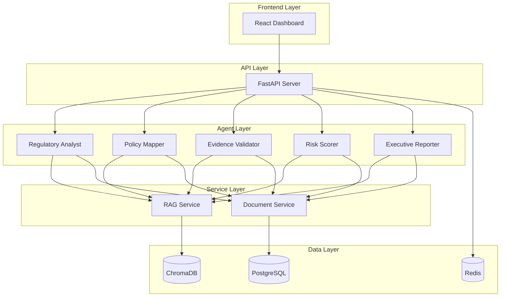

# Enterprise Compliance AI Platform

An AI-powered multi-agent compliance platform built with CrewAI for enterprise regulatory compliance management.

## 🚀 Features

- **Multi-Agent System**: 5 specialized CrewAI agents for comprehensive compliance management
- **Regulatory Analysis**: Automated extraction and interpretation of regulatory requirements
- **Policy Mapping**: Intelligent mapping of internal policies to regulatory controls
- **Evidence Validation**: Automated validation of compliance evidence and artifacts
- **Risk Scoring**: Advanced risk assessment and prioritization
- **Executive Reporting**: Board-ready compliance reports and dashboards
- **Modern UI**: React-based dashboard with Material-UI components
- **Real-time Monitoring**: Live compliance metrics and alerts

## 🏗️ Architecture



## 📋 Prerequisites

- Python 3.11+
- Node.js 18+
- Docker & Docker Compose
- OpenAI API Key
- Anthropic API Key (optional)

## 🛠️ Installation

### Using Docker (Recommended)

1. Clone the repository:
```bash
git clone https://github.com/your-org/enterprise-compliance-ai.git
cd enterprise-compliance-ai
```

2. Copy environment file:
```bash
cp .env.example .env
```

3. Configure your API keys in `.env`:
```
OPENAI_API_KEY=your_openai_api_key
ANTHROPIC_API_KEY=your_anthropic_api_key
```

4. Start all services:
```bash
docker-compose up -d
```

5. Access the application:
- Frontend: http://localhost:3000
- Backend API: http://localhost:8001
- API Documentation: http://localhost:8001/docs

### Manual Installation

#### Backend Setup

1. Install Poetry:
```bash
pip install poetry
```

2. Install dependencies:
```bash
poetry install
```

3. Set up database:
```bash
poetry run alembic upgrade head
```

4. Run backend:
```bash
poetry run uvicorn src.api.main:app --reload
```

#### Frontend Setup

1. Navigate to frontend directory:
```bash
cd frontend
```

2. Install dependencies:
```bash
npm install
```

3. Start development server:
```bash
npm start
```

## 🎯 Usage

### Quick Start

1. **Upload Documents**: Navigate to Documents page and upload regulatory documents
2. **Configure Policies**: Add your internal policies in the Policies section
3. **Run Analysis**: Go to Compliance page and initiate compliance analysis
4. **Review Results**: Check Dashboard for compliance metrics and risk scores
5. **Generate Reports**: Use Reports section to create executive summaries

### API Endpoints

- `POST /api/v1/compliance/analyze` - Run compliance analysis
- `GET /api/v1/compliance/status/{id}` - Check analysis status
- `POST /api/v1/documents/upload` - Upload documents
- `GET /api/v1/dashboard/metrics` - Get dashboard metrics
- `GET /api/v1/reports/generate` - Generate compliance report

## 🧪 Testing

Run tests with:
```bash
# Backend tests
poetry run pytest tests/ -v

# Frontend tests
cd frontend && npm test

# Integration tests
docker-compose -f docker-compose.test.yml up --abort-on-container-exit
```

## 📊 Monitoring

- Prometheus metrics: http://localhost:9090
- Grafana dashboards: http://localhost:3001 (admin/admin)

## 🚢 Deployment

### AWS ECS Deployment

1. Build and push Docker images:
```bash
./scripts/build-and-push.sh
```

2. Deploy infrastructure:
```bash
cd terraform
terraform init
terraform apply
```

3. Deploy application:
```bash
aws ecs update-service --cluster compliance-cluster --service compliance-service --force-new-deployment
```

### Kubernetes Deployment

```bash
kubectl apply -f k8s/
```

## 🔒 Security

- All API endpoints are secured with JWT authentication
- Data encryption at rest and in transit
- Role-based access control (RBAC)
- Audit logging for all operations
- Regular security scanning with Snyk

## 📝 Configuration

Key configuration files:
- `.env` - Environment variables
- `config/settings.yml` - Application settings
- `prometheus.yml` - Monitoring configuration
- `nginx.conf` - Reverse proxy configuration

## 🤝 Contributing

1. Fork the repository
2. Create feature branch (`git checkout -b feature/AmazingFeature`)
3. Commit changes (`git commit -m 'Add AmazingFeature'`)
4. Push to branch (`git push origin feature/AmazingFeature`)
5. Open Pull Request

## 📄 License

This project is licensed under the MIT License - see LICENSE file for details.

## 🆘 Support

For issues and questions:
- GitHub Issues: [Create an issue](https://github.com/your-org/enterprise-compliance-ai/issues)
- Documentation: [Full documentation](https://docs.compliance-ai.com)
- Email: support@compliance-ai.com

## 🎉 Acknowledgments

- CrewAI for the multi-agent framework
- LangChain for RAG capabilities
- OpenAI for LLM services
- Material-UI for React components